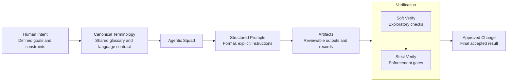

# Agentic Squad Framework White Paper

## From Ad-Hoc AI Usage to Governed Agent Systems

**Version:** 1.0.1  
**Last updated:** 2026-01-17

> This white paper is published at:  
> https://merukimoon.com/en/thinking/white-papers/agentic-squad-framework
>
> This Markdown version is the canonical, version-controlled source used for collaboration, review, and iteration.

## Executive Summary

As AI agents become part of everyday engineering workflows, teams increasingly face a new class of problems: semantic drift, unclear responsibilities, fragile automation, and loss of shared context.

This paper defines Agentic Squad Framework as a governance-first framework for agentic systems. This is not a library, SDK, or toolkit. It establishes how agentic systems are structured, governed, and executed through explicit agent contracts and rule-based, deterministic validation and enforcement gates.

Instead of treating agents as isolated tools, the framework treats them as role-based participants in a system, governed by explicit contracts, terminology, and verification stages that are structured, validated, and enforced.

The goal is predictable, reviewable, and auditable collaboration between humans and agents under constrained behavior and explicit acceptance boundaries.

This paper is for engineers and maintainers who need agent behavior to be reviewable and repeatable. Read it to understand the core roles, shared terminology, and verification boundaries that make multi-agent work operationally safe.

## What Makes This Framework Different

- Role-based agents, not prompt-centric helpers: responsibilities and boundaries come first, prompts follow.
- Terminology as a first-class system component: shared meaning is treated as infrastructure, not optional documentation.
- Verification as an explicit boundary: quality, security, and compliance gates are defined as part of the system, not left to ad-hoc review.
- A deterministic, rule-based engine as the source of truth: it validates schemas, enforces capability boundaries, evaluates verification feasibility, and either accepts, rejects, or falls back; it does not infer, reinterpret, repair, or improvise plans.
- Governance through an explicit execution model, not discipline or best practices.

## 1. The Problem: AI Without Structure

Most teams start using AI agents organically:

- prompts live in chats or ad-hoc scripts
- terminology evolves implicitly
- responsibilities blur
- verification is manual or absent

At small scale, this feels productive.  
At team or organization scale, it becomes risky.

Typical failure modes include:

- the same term meaning different things in different prompts
- agents producing correct-looking but incompatible outputs
- reviewers unsure what an agent is actually responsible for
- automation that cannot be trusted or reused

The core issue is not model quality.  
It is lack of structure and governance.

These failures are structural, stemming from missing acceptance boundaries rather than incidental mistakes.

## 2. A Different Mental Model: Agents as System Actors

Agentic Squad Framework starts from a simple shift:

AI agents are not tools.  
They are actors inside a system.

Just like human roles, agents require:

- a clear scope
- defined responsibilities
- shared language
- verification boundaries

Without these, scaling agent usage is indistinguishable from scaling chaos.

Agents operate within constraints they do not control; they are governed actors, not autonomous collaborators.

## 3. Core Principles

### 3.1 Explicit Roles Over Generic Agents

Each agent represents a role, not a capability bundle.

Examples:

- Architect
- Tech Lead
- PR Reviewer
- CISO
- Coordinator

A role answers one question clearly:  
What is this agent responsible for, and what is it not responsible for?

This immediately reduces overlap and ambiguity.

Roles define responsibility boundaries and exist independently of specific agent implementations.

### 3.2 Canonical Terminology as Infrastructure

Language is treated as infrastructure, not documentation.

A canonical terminology glossary:

- defines shared meaning
- prevents semantic drift
- acts as a contract between agents and humans

Terminology governs interpretation of outputs, not only prompt formulation.

Early stages use a Soft-Verify approach:

- glossary is canonical
- but subject to refinement
- changes are visible, not blocking

This allows evolution without losing coherence.

### 3.3 Prompts as Executable Contracts

Prompts are structured, not conversational.

The framework uses explicit prompt models to ensure that:

- intent is unambiguous
- scope is constrained
- outputs are reviewable

A prompt is treated as a declarative output contract, not an execution mechanism.

- Planning is performed by agents producing structured outputs.
- Execution authority always belongs to the engine.
- Enforcement is rule-based: the engine validates schema and constraints, enforces capability boundaries, evaluates verification feasibility, and then accepts, rejects, or falls back without reinterpretation or repair.

Prompts are declarative inputs to a governed system; acceptance of outputs is external to the agent itself.

### 3.4 Verification Is a First-Class Concept

Verification is not an afterthought.

Every meaningful agent action defines:

- what "done" means
- how correctness is checked
- what happens when verification fails

The framework supports progressive rigor:

- Soft-Verify during exploration
- Strict Verify when systems stabilize

This mirrors how mature engineering systems evolve.

Verification defines what is considered real in the system; execution without verification is intentionally incomplete.

## System Overview

This diagram summarizes how the principles above combine into a single system.

System overview  
Agentic Squad Framework treats language as shared infrastructure, agents as role-based actors, and verification as an explicit system boundary.

A canonical terminology glossary provides a single source of truth. Agents operate through structured prompts, producing reviewable outputs. Responsibility flows through planning, execution, and validation boundaries, keeping artifacts explicit and acceptance governed.

## 4. From Ad-Hoc to Governed: A Progressive Path

Agentic Squad Framework supports controlled maturation rather than experimentation.

Typical progression:

1. Introduce role-based agents
2. Establish shared terminology
3. Use structured prompts
4. Add lightweight verification
5. Gradually enforce stricter gates where value justifies it

At every step, constraint increases while preserving usability.

## 5. What This Is Not

To avoid confusion, the framework is not:

- a replacement for human decision-making
- a fully automated AI platform
- a rigid bureaucracy for prompts
- a model-specific solution

It is intentionally:

- model-agnostic
- tool-agnostic
- organization-friendly

Rigidity is selective and intentional; the framework complements existing engineering practices rather than replacing them.

## 6. Why This Matters Now

As AI becomes embedded in delivery pipelines, architecture decisions, reviews, and security checks, teams face a choice:

- scale usage and accept growing risk
- or introduce governance that scales with them

Agentic Squad Framework offers a third option:  
scale AI usage with the same discipline used for human systems. Governance is a prerequisite for reuse and trust, not overhead.

## 7. Intended Audience

This framework is designed for:

- engineering leaders
- architects
- tech leads
- teams experimenting with multi-agent workflows

Especially those who care about:

- predictability
- shared understanding
- long-term maintainability

It is relevant to maintainers and long-term owners who need system stability, not just initial adoption.

## 8. Conclusion

AI agents are collaborators inside a governed system.

Treating them as such requires:

- structure
- language
- contracts
- verification

Agentic Squad Framework provides an incremental way to build agent systems that engineers can trust, reason about, and evolve.

The objective is stable, reviewable systems, not speculative autonomy.

## Practical Run Examples

This repository contains practical run examples that demonstrate the concepts and boundaries described in this paper in real scenarios.

See:

- docs/run-examples/architecture-change
- docs/run-examples/pr-completion

These examples focus on process, role boundaries, and verification, not just outputs. They illustrate system behavior and boundaries, not feature checklists.

## Status and Evolution

This white paper describes stable principles. Evolution is expected within defined constraints, not by loosening core concepts.
